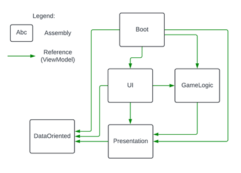

#### **General Architecture Overview**

The document outlines the architecture of the game system, focusing on the organization and responsibilities of various components. The design follows a separation of concerns approach to enable scalability, maintainability, and testing. The system is modular, with clear distinctions between views, models, controllers, services, and configuration data.

---

#### **Overall architecture Diagram**

DataFlow

---

#### **Main Concepts**

1. **Views, Services, and Controllers**:

   * **View**: A `MonoBehaviour` that links the game object world to the C# world. It contains basic game logic and reference variables. If the logic becomes too complex, it should be moved to a **Controller** or **Service**.
   * **Controller**: Manages operational logic and flow control. Handles complex logic that doesn't belong in the **View**.
   * **Service**: Static classes that perform operations not tied to the game object lifecycle, such as data processing.

2. **ViewModels**:

   * A `ViewModel` is a static class containing all public methods exposed by an assembly. It serves as a central point of interaction with a specific assembly and holds logic that would otherwise be spread across multiple controllers. If a **ViewModel** becomes too large, its logic should be moved to a **MainController**.

3. **Assertions**:

   * Assertions ensure that assumptions about data and program state hold true during execution. They help quickly catch bugs by throwing exceptions when invalid states are detected.

4. **Config and Data**:

   * **Config** and **Data** are `ScriptableObjects`. **Config** holds global parameters, while **Data** stores instance-specific data. **Configs** are injected, while **Data** is referenced inside the **Config**. Both are read-only during runtime.

5. **Reference Holders**:

   * These are used to store references to important scene objects, making it easier to access them without needing to search by tags or names.

6. **Assembly-Level Runtime Data and Collections**:

   * Runtime data typically consists of **DTOs** (Data Transfer Objects) created during gameplay. These objects are assigned an ID for easy reference, and groups of DTOs may be encapsulated within collections.

7. **Data-Oriented**:

   * This section discusses exceptions to the architecture rules for data-oriented systems. Specifically, prefabs are managed via a **PrefabAuthoring** component, and automated world creation is controlled manually for greater flexibility.

---

### **Key Practices for Code Conventions**

* **Naming Conventions**:

  * Use **PascalCasing** for public and internal variables, and **camelCasing** for private variables.
  * Avoid Hungarian notation and unnecessary abbreviations unless they are widely understood.
  * Constants are named in **UPPERCASE**.

* **Code Structure**:

  * Each script begins with a `namespace` matching the folder structure.
  * Use the `private` keyword only when necessary.
  * Group methods and properties logically, especially related ones like React methods.

* **Brackets and Expressions**:

  * Avoid unnecessary brackets. Use expression-bodied properties and methods where applicable.
  * For clarity, use single-line expressions rather than more verbose multi-line ones.

* **Declaration Order**:

  * Follow a specific order for class members: nested types first, followed by properties (sorted by access modifier), variables, constructors, Unity lifecycle methods, and then other methods. Methods should be grouped by their access modifier (public, internal, private).

This architecture is designed to facilitate a clean, modular, and testable game system, enabling easy maintenance and scaling as the project grows.
